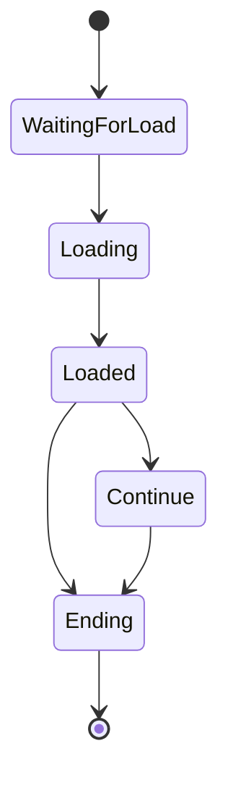

# Loading Screen for Unity

A fully customizable loading screen package for Unity, designed to enhance your game's loading experience with rich
features and seamless integration.


## 🚀 Installing

Follow these steps to integrate the package into your Unity project:

- Open the **`Window`** tab in Unity's toolbar.
- Select **`Package Manager`**.
- In the `Package Manager` window, click the **`+`** button.
- Choose **`Add package from git URL`**.
- Enter the following URL:
  ```
  git+ssh://git@github.com/erayaydin/net.fracto.loadingscreen.git
  ```

## 🛠️ Usage

### Instantiating the Loading Screen Prefab

Start by instantiating the loading screen prefab in your scene:

```csharp
[SerializeField]
private GameObject loadingScreenPrefab;

public GameObject initializeLoadingScreen()
{
    return Instantiate(loadingScreenPrefab);
}
```

You can load scenes using the `LoadingScreen.LoadScene()` method:

```csharp
public void StartLoading()
{
    var loadingScreenObj = initializeLoadingScreen();
    var loadingScreen = loadingScreenObj.GetComponent<LoadingScreen>();
    var sceneLoadContext = new SceneLoadContext(
        "Level2", 
        "Level #2", 
        "An amazing level!"
    );
    
    loadingScreen.LoadScene(sceneLoadContext);
}
```

### 🎯 Scene Load Context

The `SceneLoadContext` struct provides detailed control over the loading screen:

```csharp
public SceneLoadContext(
    string sceneName, // Name of the scene
    string title = null, // Title displayed on the loading screen
    string description = null, // Description displayed on the loading screen
    int continueToWait = 10, // Time (in seconds) to display the continue section (0 for immediate transition)
    IList<Sprite> backgroundImages = null, // Background images for the loading screen
    IList<HintManager.Hint> hints = null, // Hint messages displayed during loading
    int minimumWait = 0, // Minimum display time (useful for fake loading)
    int backgroundImageChangeSpeed = 0 // Speed of background image transitions
);
```

### 📝 Scene Info (Recommended)

For enhanced usability, create a `SceneInfo` scriptable object:

1. Navigate to **`Assets > Create > Fracto > Loading Screen > Scene Info`**.
2. Configure scene name, hints, background images, title, description, and continue section settings.

Example usage:

```csharp
[SerializeField]
private SceneInfo level2;

public void startLoading()
{
    var loadingScreen = loadingScreenObj.GetComponent<LoadingScreen>();
    loadingScreen.LoadScene(level2);
}
```

You can also define `minimumWait` seconds and `backgroundImageChangeSpeed`:

```csharp
[SerializeField]
private SceneInfo level2;

public void startLoading()
{
    var loadingScreen = loadingScreenObj.GetComponent<LoadingScreen>();
    loadingScreen.LoadScene(level2, minimumWait: 20, backgroundImageChangeSpeed: 15);
}
```

## 🔔 Events

Listen to the `LoadingStarted` and `LoadingEnd` events to add custom behavior during the loading process:

```csharp
var loadingScreen = loadingScreenObj.GetComponent<LoadingScreen>();

loadingScreen.LoadingStarted += () =>
{
    // Actions to perform when loading starts
};

loadingScreen.LoadingEnd += () =>
{
    // Actions to perform when loading ends
};
```

## 🎨 Creating custom loading screen

You can customize the default loading screen prefab to fit your game's theme:

- Adjust animations.
- Modify element positions.
- Use different spinners.

## 🔄 Spinners


This package includes five pre-built spinners:

- **Dots**
- **Hive** (default)
- **Material**
- **Orb**
- **Triad**

To change the spinner:

1. Duplicate the default loading screen prefab.
2. Replace the `Spinner` game object with your preferred spinner.

## 🌀 Finite State Machine Integration

This loading screen system uses a Finite State Machine (FSM) to manage different stages of the loading process.
The states ensure that the loading flow is organized and extensible.

### 📋 Loading Screen States



The loading screen goes through the following states in order:

1. **`WaitingForLoadState`:** This is the initial state where the loading screen waits for the scene to be ready for
loading.
2. **`LoadingState`:** This state is active during the loading process, where assets or scenes are being loaded.
3. **`LoadedState`:** After the scene is loaded, this state handles transitioning to either the `ContinueState` or
`EndingState`.
4. **`ContinueState`:** Displays the continuation or next steps to the user.
5. **`EndingState`:** Marks the end of the loading process and transitions to the main scene.

### ⚙️ State Interface: `ILoadingState`

Each state implements the `ILoadingState` interface, allowing developers to manage how each state behaves.
The interface contains three methods:

- **Enter:** Called when entering a state. Use it to initialize any variables or prepare the state.
- **Update:** Called every frame while the state is active. Use it for ongoing updates during the state.
- **Exit:** Called when exiting the state. Use it for cleaning up resources or resetting variables.

```csharp
namespace Fracto.LoadingScreen.States
{
    public interface ILoadingState
    {
        void Enter(LoadingScreen context);
        void Update(LoadingScreen context);
        void Exit(LoadingScreen context);
    }
}
```

### 🚦 Managing State Transitions

To manage state transitions, the `LoadingScreen` class maintains the current state and transitions between them.
Developers can extend or modify the behavior of each state by creating custom implementations of the `ILoadingState`
interface.

For example, you can easily switch between states like this:

```csharp
public void Update(LoadingScreen context)
{
    if (...)
    {
        context.SetState(new AnotherState());
    }
}
```
